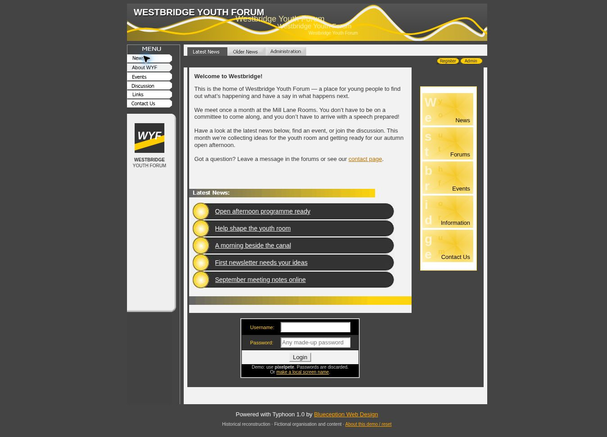

# Westbridge Youth Forum

A working reconstruction of a mid-2000s community website, originally built with PHP and MySQL.

The demo recreates its news pages, discussion forum and administration tools in HTML, CSS and JavaScript. It retains the original fixed-width layout, bitmap graphics, rollover menus and small typography, alongside Blueception and Farsight production credits and surviving code quirks.

The organisation, members and content are fictional. Interactive changes stay in your browser.

A preservation project exploring how the site looked and worked, with its period character intact.

