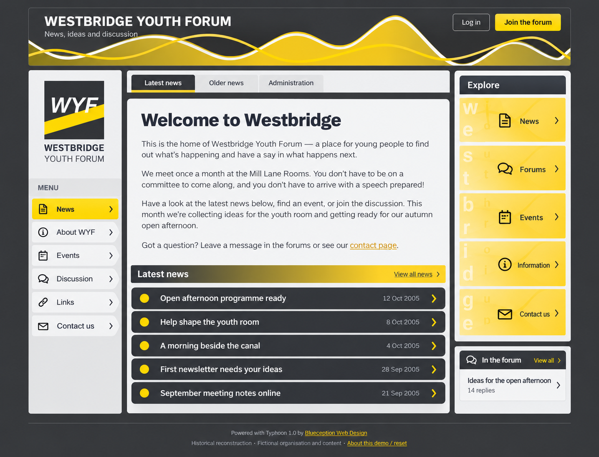

# Westbridge Youth Forum

[Open demo site](https://farsightproductions.github.io/wyc-demo/)

A working reconstruction of a mid-2000s community website, originally built with PHP and MySQL.

The demo recreates its news pages, discussion forum and administration tools in HTML, CSS and JavaScript. It retains the original fixed-width layout, bitmap graphics, rollover menus and small typography, alongside Blueception and Farsight production credits and surviving code quirks.

The organisation, members and content are fictional. Interactive changes stay in your browser.

A preservation project exploring how the site looked and worked, with its period character intact.

## Explore

- The front page has the latest five news stories, with full articles and an Older News list.
- About, Events, Links and Contact retain the information-page structure.
- Five forum boards contain 19 topics and 77 fictional posts. The open-afternoon planning thread has a second page.
- Login as `pixelpete` with any made-up password, or register a new fictional screen name. Passwords are **discarded**, not checked or stored.
- The Administration panel lets you switch between guest, member (`pixelpete`), moderator (`skylark`) and administrator (`amberwire`) demonstrations.
- Members can create topics and replies, edit their posts and update a fictional profile. Moderators can manage their own board's topics and posts. Administrators can also edit news and information pages, manage fictional users/boards and edit the demonstration censorship list.
- File Administration offers a **local** text/image cabinet with previews. Nothing is uploaded to a server. Small PNG/JPEG/GIF pictures and text files are supported; SVG and executable files are not.
- “About this demo / reset” in the footer restores the seed content and removes local changes for this copy of the site.

Changes are saved in this browser's localStorage, scoped by the page path. They are not shared with other visitors or devices. If browser storage is unavailable, the demonstration continues in memory for the current visit. Use invented information only. New activity follows a fictional 14 October 2005 clock, advancing one minute per new item.

## Refreshed version

